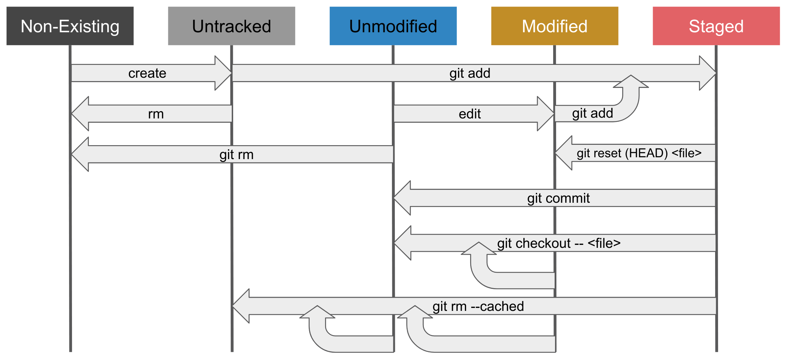

# Learning Note for Git and Github

## Useful Resources:

- 

    - 

    - Branching & Merging: 
    
        - 

        - 
        
    - 
    
## Life Cycle of a File in Git:

This diagram was created using Google Slides at: 

